# 激活码使用方法

## 快速导航
- [1、激活码使用，登录Kiro流程](#heading_0)
- [2、Kiro处理风控及Too Many报错解决方法](#heading_6)
-   [如何通过开启魔法解决限制](#heading_8)
-   [无法选择模型的原因](#heading_11)
- [Kiro 交流群](#heading_12)

---

[Kiro 软件官方下载链接](https://kiro.dev/downloads/)

### 1、[激活码使用地址](http://code.zoutask.com/)输入激活码，点击兑换

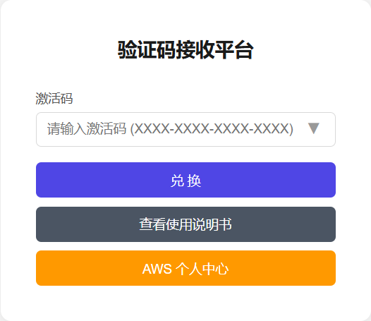

### 2、登录成功后，点击账号自动复制账号

注意：已经登录过浏览器有历史记录的，可点击aws个人中心退出账号

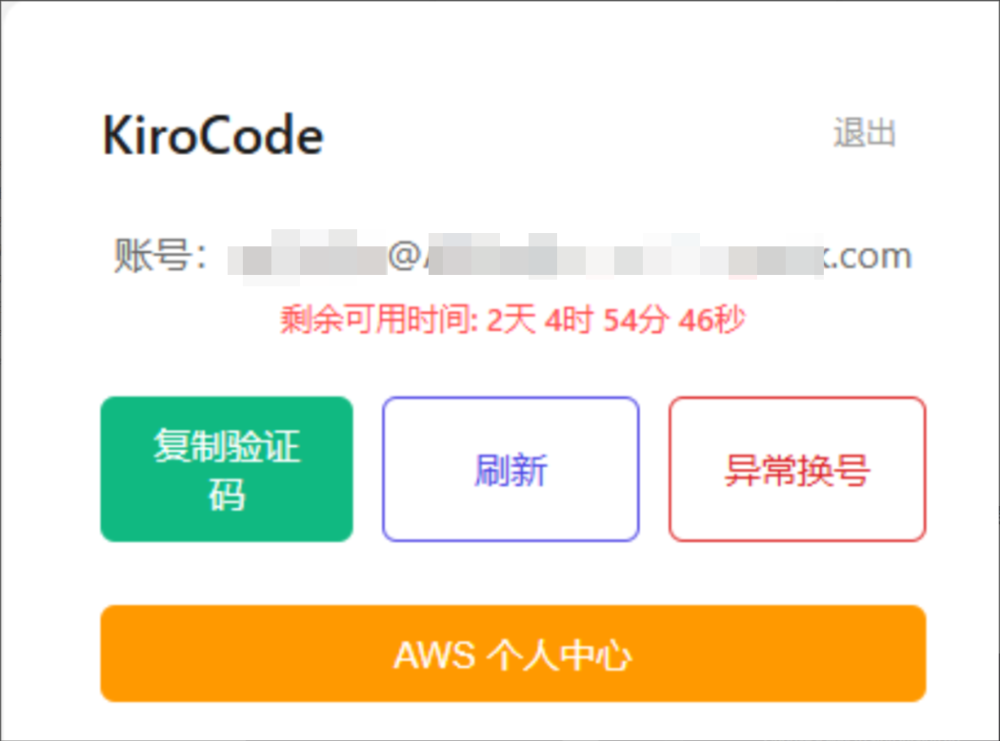

### 3、打开Kiro软件，点击Sign in进行登录，浏览器弹出页面点击Builder ID进行跳转授权页面，点击允许访问

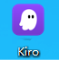

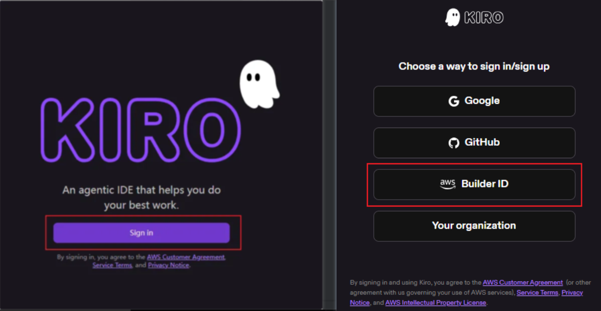

### 4、输入复制的账号点击继续，自定义输入姓名，进入下一页

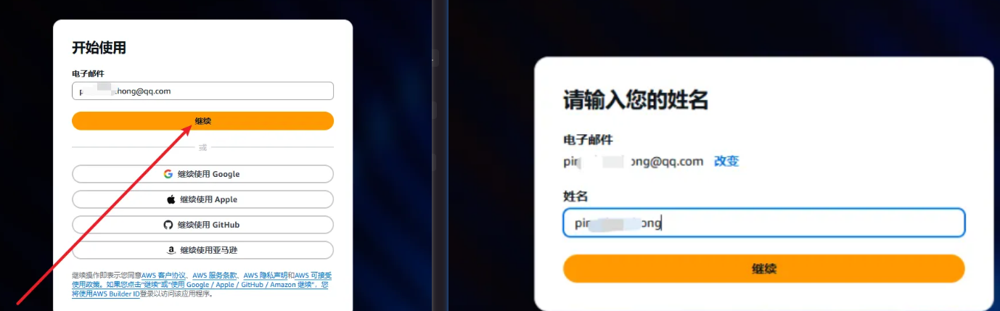

### 5、接收邮箱验证码，输入至AWS进行验证

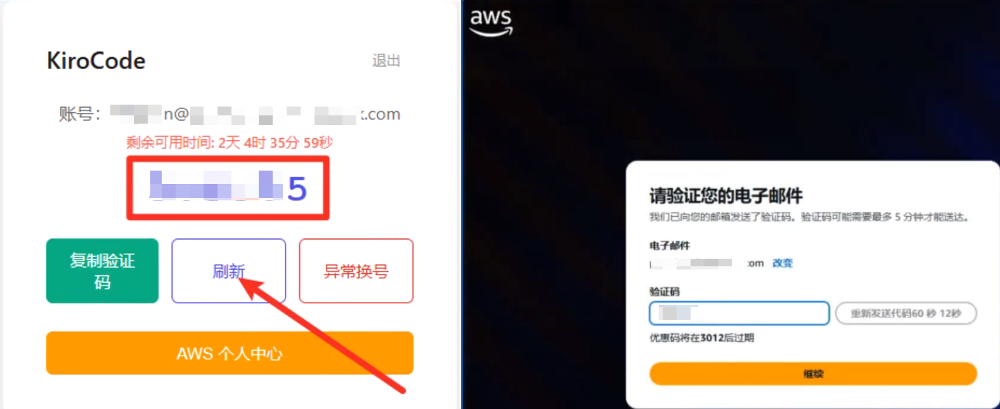

### 6、自定义设置密码，完成Kiro账号的注册

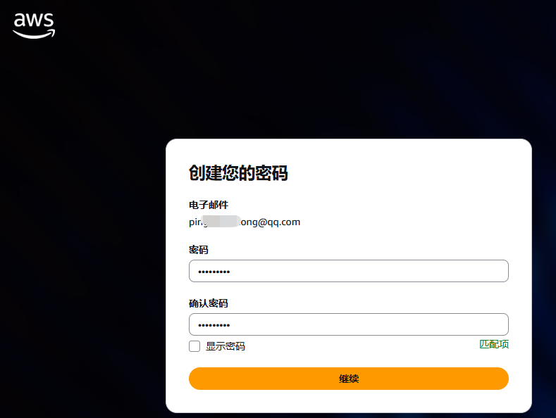

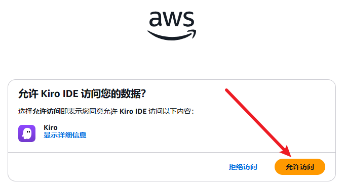

## Kiro处理风控及too many报错解决方法

注意：尽量使用 **欧美节点、欧美节点、欧美节点** [**链接查看IP质量**](http://ping0.cc) **大部分封号和拥堵问题都是魔法质量问题**

### 出现此错误为官方限制

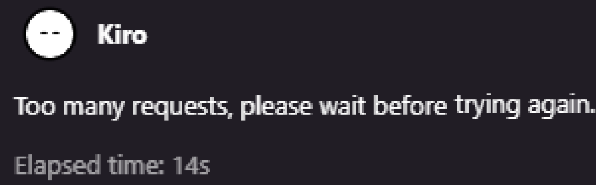

### 可以通过开启魔法解决，方法如下：

#### 方法1、打开魔法开启系统代理+全局+TUN虚拟网卡

[12块/年的便宜魔法，实测选择美节点可以稳定使用，点击跳转链接](https://vgvg.vg/#/register?code=6kmwTsxZ)

**注意：Claude模型**官方明确不支持中国大陆、中国香港、中国澳门、俄罗斯等地区。节点尽量使用北美（美、加）、欧洲大部分国家（英、法、德等）、亚洲的日本、新加坡、韩国以及大洋洲的澳大利亚和新西兰等地区

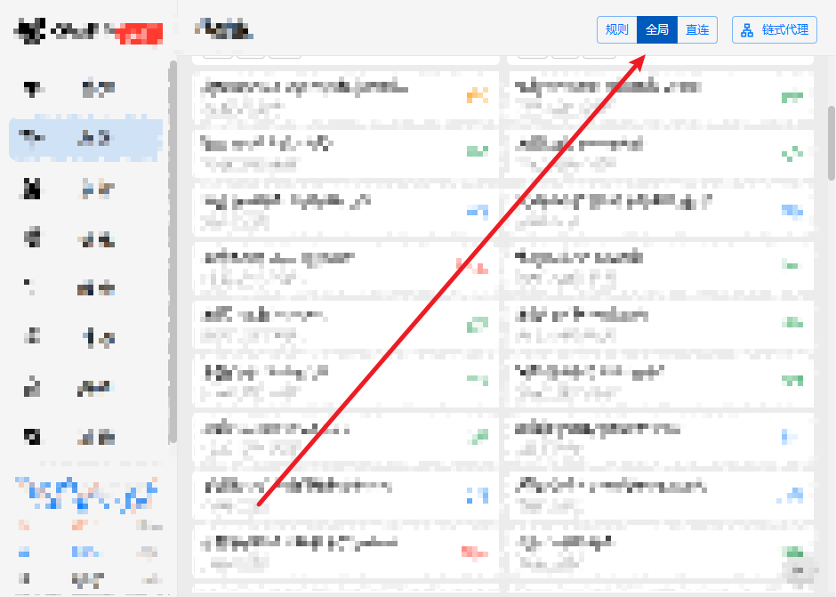

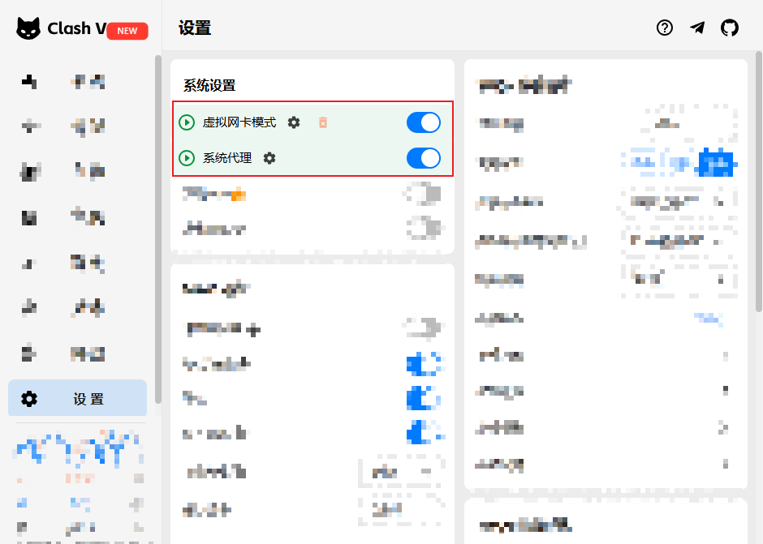

#### 方法2、打开魔法启动代理+全局后，在点击网络和Internet设置，弹出系统页面点击代理，确认端口，打开Kiro，点击File — Preferences — Settings — 搜索Proxy — 填写本地IP与端口号（与系统代理页面相同）

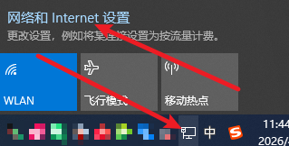

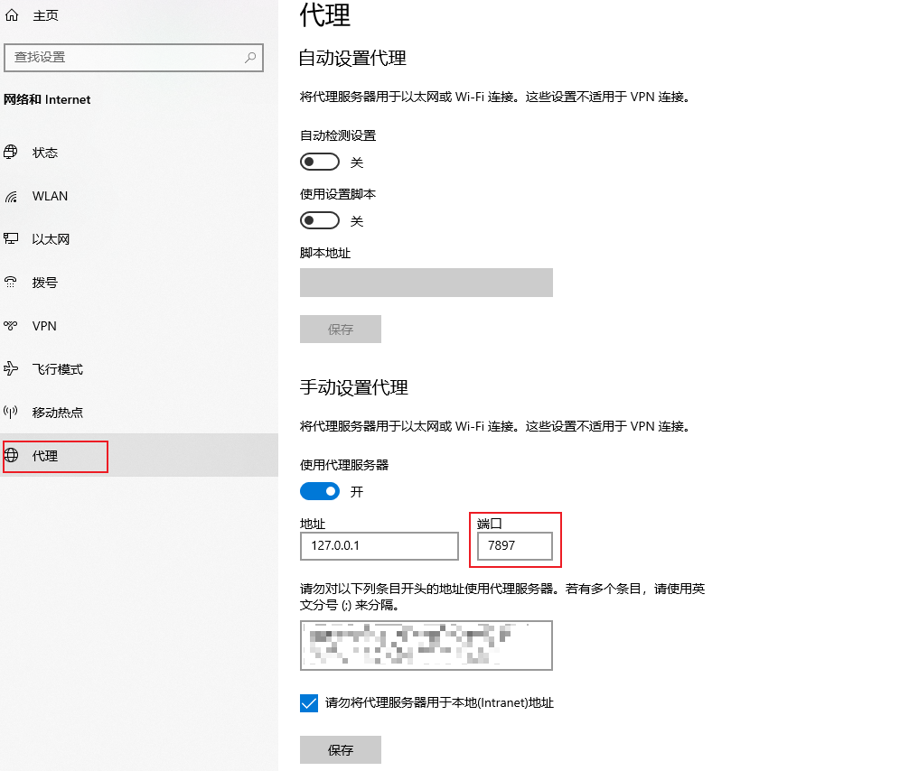

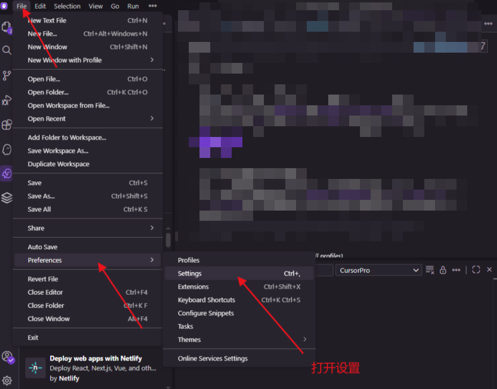

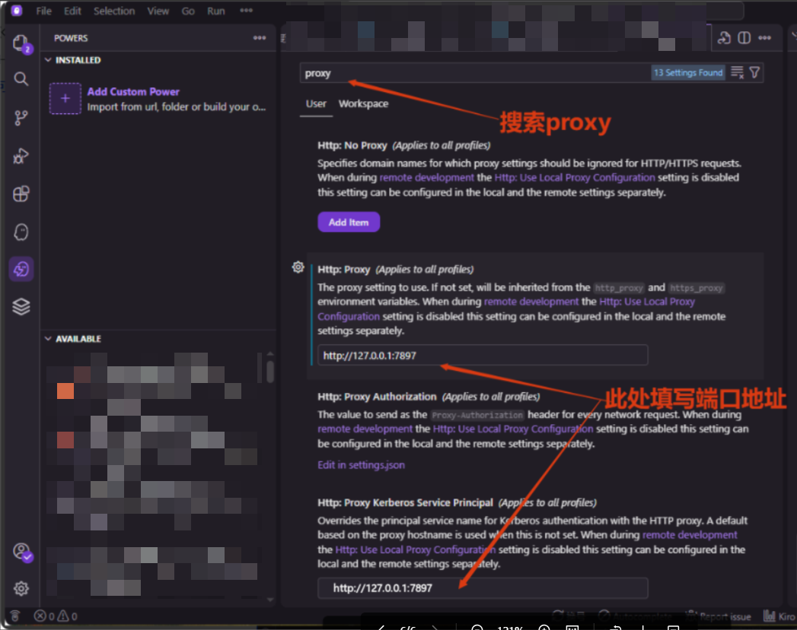

### 无法选择模型原因

2026年4月17日Kiro更新，封号不报异常了积分正常显示，只是无法选择模型，切换其他节点后重启Kiro还无法选择，可自行切换账号

